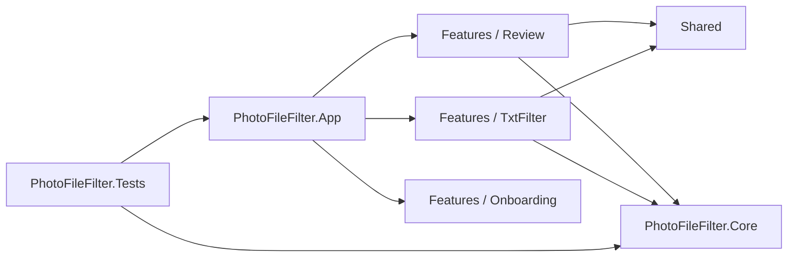

# Cấu trúc và quyền sở hữu mã nguồn

Tài liệu này giúp người bảo trì xác định nơi cần sửa trước khi đọc toàn bộ solution. Dự án dùng cách tổ chức **feature-first** cho ứng dụng WPF và giữ nghiệp vụ xử lý file trong một project độc lập.

## Sơ đồ phụ thuộc

`PhotoFileFilter.Core` không tham chiếu WPF hoặc project ứng dụng. UI có thể gọi Core; Core không được gọi ngược lên UI.

## Bản đồ thư mục

| Đường dẫn | Phạm vi sở hữu |
| --- | --- |
| `src/PhotoFileFilter.App/App.xaml*` | Khởi động ứng dụng, composition root và tài nguyên toàn cục |
| `src/PhotoFileFilter.App/Features/Onboarding` | Chọn ngôn ngữ và trải nghiệm lần chạy đầu |
| `src/PhotoFileFilter.App/Features/Review/Views` | Cửa sổ Review, event UI và XAML |
| `src/PhotoFileFilter.App/Features/Review/ViewModels` | Trạng thái Grid/Loupe, rating, filter, zoom và lệnh Review |
| `src/PhotoFileFilter.App/Features/Review/Models` | Kiểu dữ liệu chỉ thuộc catalog Review |
| `src/PhotoFileFilter.App/Features/Review/Services` | Import, catalog, session, preferences và histogram |
| `src/PhotoFileFilter.App/Features/Review/Controls` | Control WPF riêng của Review, gồm panel ảo hóa |
| `src/PhotoFileFilter.App/Features/Review/Converters` | Converter dùng trong XAML Review |
| `src/PhotoFileFilter.App/Features/TxtFilter/Views` | Workspace TXT Filter, host và Quick Preview |
| `src/PhotoFileFilter.App/Features/TxtFilter/ViewModels` | Trạng thái quét, kết quả, chọn file và tiến độ copy |
| `src/PhotoFileFilter.App/Features/TxtFilter/Models` | Kiểu dữ liệu giao diện chỉ thuộc TXT Filter |
| `src/PhotoFileFilter.App/Features/TxtFilter/Services` | Lưu/khôi phục cấu hình TXT Filter |
| `src/PhotoFileFilter.App/Shared/Services` | Dịch vụ dùng bởi từ hai feature trở lên: dialog, ngôn ngữ, theme và preview |
| `src/PhotoFileFilter.App/Shared/Localization` | Markup extension và binding cập nhật chuỗi giao diện khi đổi ngôn ngữ |
| `src/PhotoFileFilter.App/Shared/UI` | Thành phần WPF dùng chung |
| `src/PhotoFileFilter.App/Shared/ViewModels` | Base class và command dùng chung |
| `src/PhotoFileFilter.App/Shared/Resources` | Style và semantic color token toàn ứng dụng; palette sáng/tối được áp dụng qua `ThemeService` |
| `src/PhotoFileFilter.Core/Matching` | Phân tích và chuẩn hóa danh sách tên |
| `src/PhotoFileFilter.Core/Scanning` | Quét thư mục và đối chiếu file |
| `src/PhotoFileFilter.Core/Copying` | Sao chép an toàn, collision policy và tiến độ |
| `src/PhotoFileFilter.Core/Safety` | Quy tắc bảo vệ đường dẫn và ảnh nguồn |
| `src/PhotoFileFilter.Core/Models` | Contract dùng chung giữa parser, scanner và copy |
| `tests/PhotoFileFilter.Tests` | Kiểm thử logic, workflow tích hợp và render WPF |
| `examples` | File đầu vào mẫu, không chứa dữ liệu người dùng thật |
| `scripts` | Công cụ hỗ trợ phát triển; không chứa logic runtime |
| `docs` | Kiến trúc, kế hoạch và quyết định bảo trì |
| `LICENSE` | Toàn văn Apache License 2.0 áp dụng cho mã nguồn |
| `NOTICE` | Thông tin bản quyền và ghi nhận phải đi cùng bản phân phối |

## Quy tắc đặt mã mới

1. Bắt đầu trong feature sở hữu hành vi. Một class chỉ dùng cho Review phải nằm trong `Features/Review`, tương tự với TXT Filter.
2. Chỉ chuyển mã vào `Shared` khi ít nhất hai feature thực sự dùng nó và nó không mang trạng thái riêng của một workflow.
3. Logic parser, scanner, copy hoặc an toàn dữ liệu phải nằm trong `PhotoFileFilter.Core` và không được tham chiếu `System.Windows`.
4. Namespace phải khớp với đường dẫn bắt đầu từ tên project, ví dụ `PhotoFileFilter.Features.Review.Services`.
5. XAML và code-behind phải nằm cạnh nhau trong `Views`.
6. Không đưa output build, ảnh test render hoặc bản portable vào Git. Các file đó thuộc `artifacts`, `bin` hoặc `obj`.
7. Không thay đổi ảnh nguồn của người dùng. Mọi thay đổi liên quan copy phải giữ temporary-file commit, kiểm tra đường dẫn và chính sách collision.
8. Chuỗi tĩnh trong XAML dùng `loc:Translate`; chuỗi động dùng `LanguageService.Text` và phải được thông báo lại trong `RefreshLanguage` của view model.

## Khi thêm một feature mới

Tạo `Features/<FeatureName>` và chỉ thêm các thư mục con cần dùng, chẳng hạn `Views`, `ViewModels`, `Models` và `Services`. Nếu feature cần thuật toán không phụ thuộc WPF và có thể tái sử dụng, đặt thuật toán đó trong một khu vực nghiệp vụ phù hợp của Core.

Mỗi thay đổi cấu trúc phải cập nhật tài liệu này, README và project reference liên quan trong cùng pull request.
